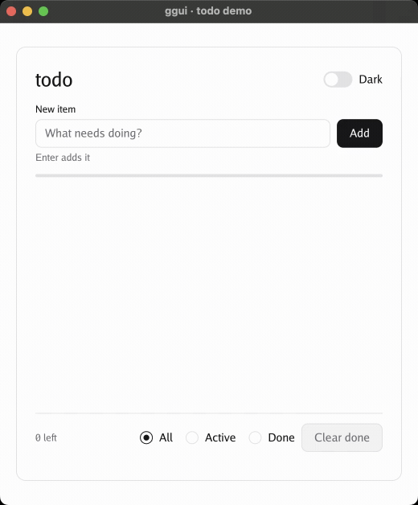
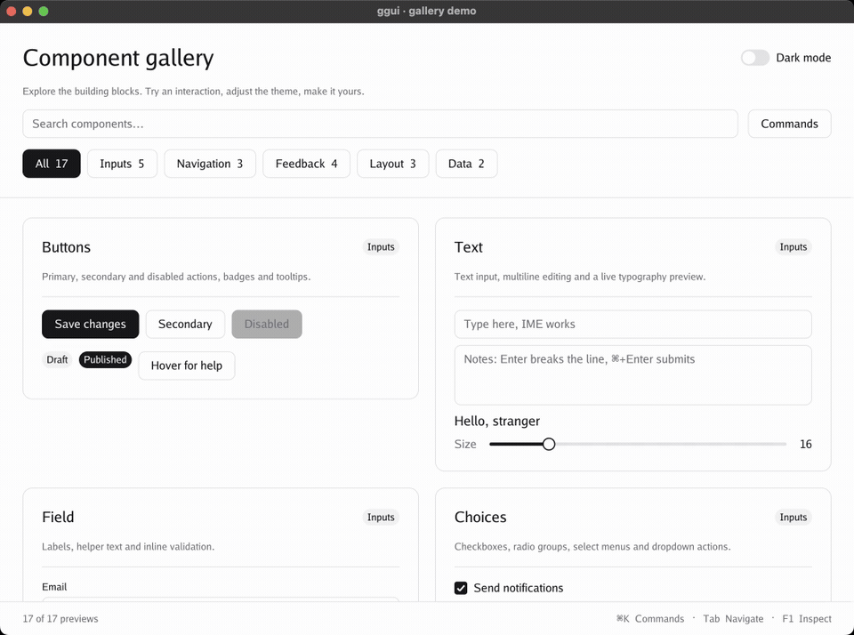

<div align="center">

# GGUI

**Reactive desktop UIs in Go. Rendered on the GPU.**

**No CGO. No WebView. Yes, GPU.**

Powered by [Ebitengine](https://ebiten.org).

[Demos](#demos) · [Quick start](#quick-start) · [Examples](#examples) · [Guide](GUIDE.md) · [Accessibility](#accessibility) · [Development](#development)

</div>

---

ggui is a cross-platform GUI framework for Go. It brings together Flutter-inspired
widget trees and layout, Svelte-style reactivity, and GPU rendering through
Ebitengine. Build your interface in Go with composable widgets, reactive state,
and controls that bind directly to your data.

> [!IMPORTANT]
> **Early development:** APIs are working but subject to change.
> Native accessibility support is currently **macOS only**.

## At a glance

| Feature | What you get |
| --- | --- |
| Reactive state | State, lazy derived values, effects, and cancellable resources. |
| Composable layouts | Rows, columns, flex, grids, stacks, scrolling, and virtualized keyed lists. |
| Ready-made controls | Buttons, text fields, tables, tabs, dialogs, command search, and more. |
| Text and input | IME composition, grapheme-aware editing, clipboard support, and font fallbacks. |
| Motion and themes | Tweens, springs, transitions, light/dark themes, and inherited style tokens. |
| Developer tools | Headless interaction tests with `Probe` and an in-app widget inspector. |

## Demos

**Todo** — add tasks, mark them complete, and switch themes.



**Component gallery** — explore reactive controls, search components, and try
animated notifications with undo actions.



Recorded from the running macOS examples, driven through the native accessibility
API. The demo builds use `AccessibilityAlways`.

## Quick start

### Install

```sh
go get github.com/ironpark/ggui
```

**Requires Go 1.27+** for generic methods in the reactive API.
ggui itself does not use CGO or a WebView. Ebitengine's platform dependencies
still apply, including Xcode command line tools on macOS and X11/ALSA development
headers on Linux; the no-CGO claim does not cover every platform dependency.

### Build a counter

Save this as `main.go` in your Go module:

```go
package main

import (
	"log"

	"github.com/ironpark/ggui"
	"github.com/ironpark/ggui/ui"
)

func main() {
	count := ggui.State(0)

	app := ggui.New(ggui.Config{
		Title:  "Hello, ggui",
		Width:  480,
		Height: 320,
	}, func() ggui.Widget {
		return ggui.Center(
			ggui.Column(
				ggui.Textf("Count: %d", count),
				ui.Button("Increment", func() { ggui.Add(count, 1) }),
			).Gap(12).Align(ggui.AlignCenter),
		)
	})

	if err := app.Run(); err != nil {
		log.Fatal(err)
	}
}
```

```sh
go run .
```

`State` holds the count, `Textf` follows it, and the button updates it.
No manual refresh or subscription wiring is needed.

## Examples

Run these commands from a checkout of this repository. The Task commands build
and launch macOS app bundles.

| Example | Explore | Run on macOS |
| --- | --- | --- |
| [Counter](examples/counter) | Reactive state, buttons, shortcuts, and theme switching. | `task run` |
| [Todo](examples/todo) | IME text input, validation, keyed lists, transitions, and a confirm dialog. | `task run-todo` |
| [Charts](examples/charts) | All 70 shadcn chart examples, interactive tooltips, themes and animation replay. | `go run ./examples/charts` |
| [Carousel & Input OTP](examples/controls) | Swipeable carousels and segmented code inputs, all shadcn variants and state previews. | `go run ./examples/controls` |
| [Gallery](examples/gallery) | Searchable previews across Inputs, Navigation, Feedback, Layout, and Data. | `task run-gallery` |

On other platforms, use `go run ./examples/counter`, `go run ./examples/todo`,
or `go run ./examples/gallery`. The gallery adapts from two columns to one in
narrow windows and keeps search, theme controls, and the command launcher visible
while scrolling.

The [counter tests](examples/counter/main_test.go) show how to drive the same UI
headlessly with a `Probe`.

## How it fits together

1. **Model state with signals.** `State`, `Derived`, and `Combine` keep data and
   computed values in sync.
2. **Compose a widget tree.** Constructors describe the content; chainable setters
   configure layout and appearance.
3. **Bind controls to state.** A control updates its binding, and changes to the
   binding update the control.
4. **Scope reactive updates.** `Component`, `If`, `EachKeyed`, and `Await` let parts of the
   interface update independently.

The core `ggui` package provides layout, reactivity, rendering, and input.
The `ui` package adds themed controls built on that public API, which you can
also use to build your own controls.

## Accessibility

**Native accessibility support is currently available on macOS only**, through
the macOS accessibility bridge for VoiceOver and other assistive tools.
Windows and Linux accessibility bridges are not yet implemented.

The default `AccessibilityAuto` mode activates the bridge when assistive
technology attaches. Set `Config.Accessibility` to `AccessibilityAlways` for
tools such as Accessibility Inspector, or `AccessibilityOff` to disable it.

Widgets also provide keyboard navigation, focus handling, semantic roles and
labels, text scaling, and reduced-motion settings. See the guide's
[input](GUIDE.md#input) section and [STYLING.md](STYLING.md).

## Documentation

| Topic | Read more |
| --- | --- |
| State and components | [Signals, ownership, builders, and keyed lists](GUIDE.md#concepts) |
| Layout and controls | [Widgets and layout](GUIDE.md#widgets-and-layout) · [Controls](GUIDE.md#controls) · [Additional controls](GUIDE.md#additional-ui-components) |
| Charts | [Native charts, options, examples and visual validation](CHARTS.md) |
| Carousel & Input OTP | [Composition, interaction, examples and visual validation](CONTROLS.md) |
| Look and feel | [Styling](STYLING.md) · [Animation](GUIDE.md#animation) · [HiDPI](GUIDE.md#hidpi) |
| Interaction and testing | [Input](GUIDE.md#input) · [Headless testing](GUIDE.md#testing) · [Inspector](GUIDE.md#inspector) |
| Internals | [Frame lifecycle](GUIDE.md#frames) · [Repository layout](GUIDE.md#repository-layout) |

## Development

```sh
task             # fmt + vet + test
task build       # build all packages
task run         # bundle and launch the counter example (macOS)
task run-todo
task run-gallery
task bundle EXAMPLE=gallery  # build the .app without launching
task clean
```

These commands use Task v3 (`brew install go-task`). On macOS, the run tasks
build `bin/ggui-<example>.app`, including its executable and `Info.plist`, then
launch it with `open -n`. Each launch starts a new instance using the rebuilt
binary. The bundles are local development builds; they are not distribution-signed
or notarized. `task build`, `task test`, and the other Go maintenance tasks also
work on other platforms; run examples there with `go run ./examples/<example>`.
Override the Go executable with `task build GO=/path/to/go` when needed.
